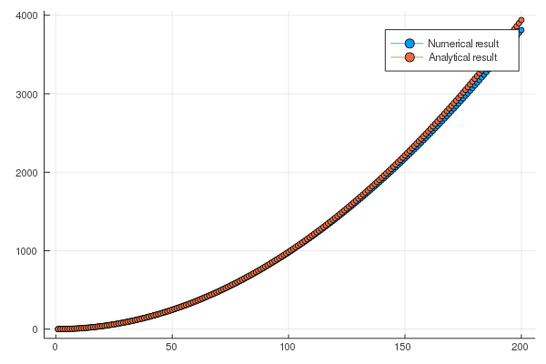

# ポテンシャルがない場合1次元シュレーディンガー方程式を解き、その後数値的に解いてみる。
時間に依存しないシュレーディンガー方程式を解いてみよう。  
数値計算的な考え方でシュレーディンガー方程式を眺めてみる。

## シュレーディンガー方程式の解
一次元系のシュレーディンガー方程式は、

```math
\left( -\frac{\hbar^2}{2m}\frac{d^2}{dx^2} + V(x) \right) \psi(x) = \epsilon \psi(x)
```
と書ける。この方程式は二階微分方程式なので、一般解には二つの未定定数が含まれ、それらの定数を決定するためには、この方程式の他に二つの方程式が必要となる。  

### 標準的なやり方

#### 未定定数
これをはっきりさせるため、一番簡単な場合(``V(x)=0)``を考えてみよう。  
この時のシュレーディンガー方程式は
```math
 -\frac{\hbar^2}{2m}\frac{d^2}{dx^2} \psi(x) = \epsilon \psi(x)
```
となる。
この方程式の解として指数関数：
```math
\psi(x) = e^{i k x}
```
を仮定すると、
```math
 \frac{\hbar^2 k^2}{2m}  e^{i k x}= \epsilon  e^{i k x}
```
となるので、
```math
\frac{\hbar^2 k^2}{2m} = \epsilon
```
すなわち、
```math
k = \pm \frac{\sqrt{2m \epsilon}}{\hbar}
```
が得られる。以上から、二つの関数
```math
\exp \left[ i \frac{\sqrt{2m \epsilon}}{\hbar} x \right], \exp \left[ -i \frac{\sqrt{2m \epsilon}}{\hbar} x \right]
```
が方程式の解であることがわかった。
そして、容易に確認出来るように、二つの解を足した解も解である。つまり、
```math
\psi(x) = C_1 \exp \left[ i \frac{\sqrt{2m \epsilon}}{\hbar} x \right] + C_2 \exp \left[ -i \frac{\sqrt{2m \epsilon}}{\hbar} x \right]
```
も解である。よって、解は``C_1``と``C_2``という未定定数を二つ持つことがわかった。
これは、上述したように、方程式が二階微分方程式であるからである。  
また、エネルギー``\epsilon``には、現時点では何も条件が課されていないため、任意の実数を取ることができる。
そしで、もし``\epsilon < 0``であれば、``k``は純虚数となる。


#### 境界条件
上述の解の係数を決めたい。  
まず、波動関数の絶対値の二乗は粒子を見出す確率であるので、全空間で粒子を見出す確率は1にならなければならない。
つまり、
```math
\int dx |\psi(x)|^2 = 1
```
である。これを規格化と呼ぶ。
この条件により、未定定数のうち一つが求まることになる。ここでの積分範囲は、考えている系全体である。  

##### 片側に壁が存在する場合
``x=0``に壁が存在する場合(``\psi(x=0)=0``)を考えよう。この場合、
```math
C_1 = - C_2
```
である必要があり、
```math
\psi(x) = C_1 \left[ \exp \left[ i \frac{\sqrt{2m \epsilon}}{\hbar} x \right] -  \exp \left[ -i \frac{\sqrt{2m \epsilon}}{\hbar} x \right] \right] = 2 i C_1 \sin  \frac{\sqrt{2m \epsilon}}{\hbar} x
```
となる。ここで、エネルギー``\epsilon``が負の時、sin関数はsinh関数となり、``x \rightarrow \infty``で値が発散してしまう。従って、
```math
\epsilon \ge 0
```
という条件が存在する。そして、エネルギーは連続の値を取ることができる。

##### 両側に壁が存在する場合
``x=0``と``x=L``に壁が存在する場合(``\psi(x=0)=\psi(x=L)=0``)を考えよう。
片側の壁の条件は全く同じなので、
```math
C_1 = - C_2
```
であり、解は
```math
\psi(x) = C_1 \left[ \exp \left[ i \frac{\sqrt{2m \epsilon}}{\hbar} x \right] -  \exp \left[ -i \frac{\sqrt{2m \epsilon}}{\hbar} x \right] \right] = 2 i C_1 \sin  \frac{\sqrt{2m \epsilon}}{\hbar} x
```
である。
しかし、この解は``\psi(x=L)=0``を常に満たすわけではない。常に満たすためには、
```math
\frac{\sqrt{2m \epsilon}}{\hbar}L = n \pi
```
である必要がある。ここで、``n``は1以上の整数である。もし、``n=0``なら解は常に0になってしまう。よって、
```math
\epsilon = n^2 \frac{\hbar^2 \pi^2}{2m L^2}
```
となる。  


***
##### 補足：エネルギーが実数である意味
実は、上述のような解き方では``\epsilon``は複素数であっても構わない。
これは、時間に依存しないシュレーディンガー方程式のみを考えているからである。  
もともとの時間依存するシュレーディンガー方程式は
```math
i \hbar \frac{\partial}{\partial t} \Psi(x,t) = \left(  -\frac{\hbar^2}{2m}\frac{\partial^2}{\partial x^2} + V(x) \right) \Psi(x,t)
```
であった。ここで、ポテンシャル``V(x)``が時間に依存しないとすれば、この偏微分方程式は変数分離することができて、解は
```math
\Psi(x,t) = f(t) \psi(x)
```
と書け、微分方程式は
```math
\frac{1}{f(t)} i \hbar \frac{\partial}{\partial t} f(t)  = \frac{1}{\psi(x)} \left(  -\frac{\hbar^2}{2m}\frac{\partial^2}{\partial x^2} + V(x) \right) \psi(x) = {\it const}.
```
となり、右辺の定数を``\epsilon``とおけば、
```math
f(t) = \exp \left(-i\frac{\epsilon}{\hbar}t \right)
```
が得られる。  
もし、``\epsilon``が複素数であり、虚部が含まれれば、``f(t)``は時間につれて発散あるいは減少する指数関数となり、
解は安定しない。つまり、定常状態の解にはならない。よって、``\epsilon``は実数である必要がある。

### 行列とベクトル
上述したやり方だと、解の形を指数関数に仮定した。より複雑な問題に対応するためには、どのようにやるのが良いだろうか。  
まず、シュレーディンガー方程式を
```math
H \psi(x) = \epsilon \psi(x)
```
と書く。ここで、
```math
H = \left( -\frac{\hbar^2}{2m}\frac{d^2}{dx^2} + V(x) \right) 
```
である。
このような形で書くと、シュレーディンガー方程式は、ハミルトニアン``H``に対する固有値問題であることがわかる。
そして、エネルギーは固有値であり、対応する解は固有関数である。
異なる固有値に属する固有関数は直交し、波動関数の二乗は確率を表すため、規格化されている。つまり、
ある固有値``\epsilon_n``に属する解を``\psi_n(x)``とすると、
```math
\int dx \psi_n(x)^{\ast} \psi_m(x) = \delta_{nm} 
```
となる。これは、直交規格化条件である。ここで、``\delta_{nm}``はクロネッカーのデルタと呼ばれ、``n=m``の時1、``n\neq m``の時0となる関数である。
#### 基底の変換とベクトル表示
さて、シュレーディンガー方程式の解をフーリエ変換で求めてみよう。ある関数``\psi(x)``のフーリエ変換は
```math
\psi(x) = \int dk e^{i k x} c_k
```
と書ける。   
これを``V(x)=0``のシュレーディンガー方程式に代入すると、
```math
\int dk \frac{\hbar^2 k^2}{2m} e^{i k x} c_k = \epsilon \int dk e^{i k x} c_k
```
となり、
```math
\int dx e^{- i k' x}\int dk \frac{\hbar^2 k^2}{2m} e^{i k x} c_k = \epsilon \int dx e^{- i k' x} \int dk e^{i k x} c_k
```
```math
\frac{\hbar^2 k^2}{2m}c_k = \epsilon c_k 
```
となるので、
```math
\epsilon = \frac{\hbar^2 k^2}{2m}
```
であれば、解となることがわかる。

次に、フーリエ変換の積分を和とみなすと、幅``dk``、高さ``e^{i k x} c_k``の長方形の面積の和となり、
```math
\psi(x) = \sum_k c_k e^{i k x} 
```
となる。ここで、``dk``は``c_k``を再定義することで押し付けた。  
さて、この形を眺めるとあることに気がつくかもしれない。  
線形代数において、ある行列``A``とベクトル``{\bf v}``の積でできたベクトル``{\bf g} = A{\bf v}``の成分表示は
```math
g_i = [A {\bf v}]_{i} = \sum_j A_{ij} v_j
```
と書ける。つまり、``\psi(x)``を``g_i``、``e^{i k x}``を``A_{ij}``、``c_k``を``v_j``と見なせば、
```math
{\bf \psi} = U {\bf c}
```
と行列とベクトルを使った解を書くことができる。
そして、異なる固有値に属する固有関数は
```math
{\bf \psi}_n = U {\bf c}_n
```
となる。これは、線形代数において基底を変換する演算そのものである。なお、この``U``はユニタリー行列である。  

ここで、線形代数では添字``i``はある離散的な値であったが、座標``x``や``k``は連続的な値であることに注意する必要がある。
ここでは詳しくは述べない。  

#### シュレーディンガー方程式の行列表示
さて、座標``x``を離散化し無数の格子点``x_i``に分割したとする。この時、格子点``x_i``での固有値``\epsilon_n``に対する解の値は``\psi_n(x_i)``である。  
この``\psi_n(x_i)``は、ベクトル表記ではどのように表せられるだろうか。  
実は、ベクトル``{\bf x_i}``:
```math
{\bf x}_i^T = (0,0,0,0,0,\cdots,0,1,0,0,\cdots,)
```
を用意すれば良い。このベクトルの成分表示は
```math
\left[ {\bf x}_i \right]_{\alpha} = \delta_{i\alpha}
```
である。  
このベクトルを使うと、
```math
\psi_n(x_i) = {\bf x} \cdot {\bf \psi}_n
```
となる。  
また、ハミルトニアン``\hat{H}``を格子点上で考える場合には、微分演算子を差分に変更する必要がある。
ある点``x_i``近傍での関数``\psi(x_i \pm a)``は、テイラー展開より
```math
\psi(x_i + a) = \psi(x_i) + \frac{d}{dx}\psi |_{x=x_i} a + \frac{1}{2} \frac{d^2}{dx^2}\psi |_{x=x_i} a^2 + \cdots 
```
```math
\psi(x_i - a) = \psi(x_i) - \frac{d}{dx}\psi |_{x=x_i} a + \frac{1}{2} \frac{d^2}{dx^2}\psi |_{x=x_i} a^2 + \cdots
```
となるので、
```math
\frac{d^2}{dx^2}\psi |_{x=x_i} \sim \frac{\psi(x_i + a) -2\psi(x_i) + \psi(x_i - a)}{a^2}
```
と微分を差分に直すことができる。一般的には、ある場所``x_i``における微分演算子は、
```math
\frac{d^2}{dx^2}\psi |_{x=x_i} \rightarrow \sum_j d_j \psi(x_j) 
```
と書けるので、シュレーディンガー方程式は、
```math
\sum_j \left(
-\frac{\hbar^2}{2m} d_j + V(x_j) \delta_{ij}
\right) \psi(x_j) = \epsilon \psi(x_i)
```
と書くことができる。  
この方程式は、先ほどと同様に行列とベクトルで表現することができて、
```math
\hat{H} {\bf \psi} = \epsilon {\bf \psi}
```
となる。これがシュレーディンガー方程式の行列表示である。  
ここで、``{\bf \psi}_n = U {\bf c}_n``を使えば、
```math
\hat{H} U {\bf c}_n = \epsilon U {\bf c}_n 
```
```math
U^+ \hat{H} U {\bf c}_n = \epsilon U^+ U {\bf c}_n 
```
```math
\hat{H}' {\bf c}_n = \epsilon {\bf c}_n
```
となる。

つまり、**xで表現しようがkで表現しようが、演算子``\hat{H}``に対する固有値問題がシュレーディンガー方程式なのである。**  
そこで、特定の``{\bf \psi}_n``や``{\bf c}_n``を使わずに、ベクトルとしてケットベクトル``|n \rangle``
を用いることで、
```math
\hat{H} |n \rangle = \epsilon |n \rangle
```
とシュレーディンガー方程式を書くことができる。

#### 座標表示との関係
上記の方程式と元の方程式との関係を見る。
まず、単位行列``\hat{I}``をベクトル``{\bf x_j}``で表現すると、
```math
\hat{I} = \sum_j {\bf x_j} {\bf x_j}^T
```
と書ける。  
行列表示の方程式にこの単位行列を挟み、左から``{\bf x_i}^T``をかけると、
```math
\sum_j {\bf x_i}^T \hat{H} {\bf x_j} {\bf x_j}^T {\bf \psi} = \epsilon {\bf x_i}^T {\bf \psi} \\
\sum_j \left(
-\frac{\hbar^2}{2m} d_j + V(x_j) \delta_{ij}
\right) \psi(x_j) = \epsilon \psi(x_i)
```
となり、元の方程式が再現される。  
また、基底``{\bf \psi}_n``、``{\bf c}_n``は、互いにユニタリー変換で結びつけられているため、
ベクトル``{\bf x_j}``も様々な基底で表現することができる。よって、これをケットベクトル``|x_i \rangle``と書く。
この時、ある基底で書かれた単位行列は
```math
\hat{I} = \sum_j |x_i \rangle \langle x_i|
```
と書ける。ここで、``\langle x_i|``はブラベクトルであり、``\langle \alpha | \beta \rangle``はベクトルの内積を表す。
以上から、
```math
\sum_j \langle x_i | \hat{H} |x_j \rangle \langle x_j |n \rangle = \epsilon \langle x_i|n \rangle
```
が得られる。  

さて、ここで離散化をやめて元の連続座標``x``について考えると、波動関数``\psi_n(x)``は
```math
\psi_n(x) = \langle x|n \rangle
```
であり、ハミルトニアンは
```math
H \psi_n(x) = \int dx' \langle x | \hat{H} |x' \rangle \langle x' |n \rangle 
```
となる。  

つまり、**ベクトル``|n \rangle ``に対する座標表示の固有値方程式が、よく見る形のシュレーディンガー方程式だったのである。**  
そして、**うまく解けるように適当に基底を選んでシュレディンガー方程式を解くことができる。**
それはフーリエ級数展開でも良いし、ベッセル関数でも良いし、チェビシェフ多項式でも良い。

## 1次元シュレーディンガー方程式の数値的解法
一番簡単なケースとして、1次元シュレーディンガー方程式を差分化して解いてみよう。  
その前に、シュレーディンガー方程式を無次元化しておく。つまり、
```math
\left( -\frac{1}{\sqrt{(2m/\hbar^2)}^2}\frac{d^2}{dx^2} + V(x) \right) \psi(x) = \epsilon \psi(x)
```
```math
\left( -\frac{d^2}{dx'^2} + V(x') \right) \psi(x') = \epsilon \psi(x')
```
```math
x' = x \sqrt{\frac{2m}{\hbar^2}}
```
としておく。
これにより、計算が容易になる。以後、``x'``は``x``と置き直す。


x軸を間隔``a``の微小な座標点の集合に書き換えるとする。そして、
二階微分を
```math
\frac{d^2}{dx^2}\psi |_{x=x_i} \sim \frac{\psi(x_i + a) -2\psi(x_i) +\psi(x_i - a)}{a^2}
```
と差分化する。  
この時、シュレーディンガー方程式は
```math
-\frac{1}{a^2} \left(\psi(x_{i+1})+ \psi(x_{i-1}) \right) + \left( \frac{2}{a^2}+  V(x_i) \right)\psi(x_i) = \epsilon \psi(x_i)
```
となる。  

座標点の数を``N``とする。  
境界条件としては、
```math
\psi(x_{-1}) = 0
```
```math
\psi(x_{N+1}) = 0
```
とする。つまり、両側が壁に囲まれている。
この時、固有値は
```math
\epsilon = n^2 \frac{\pi^2}{L^2}
```
である。``L = (N+1)*a``である。

この時のハミルトニアンを作成するJuliaのコードは以下のようになる。

```julia
function make_H1d(N,a)
    mat_H = zeros(Float64,N,N)
    vec_V = zeros(Float64,N)
        
    for i in 1:N
        for dx in -1:1
            j = i + dx
            v = 0.0
            if dx == 0
                v = (2/a^2 + vec_V[i])
            elseif dx == 1
                v = -1/a^2
            elseif dx == -1
                v = -1/a^2
            end
            
            if 1 <= j <= N
                mat_H[i,j] = v
            end
            
        end
        
    end
    
    
    return mat_H
end
```

この行列を対角化し、固有値の分布を出してみよう。  

まず、プロット用のmoduleを読み込む。

```julia
using Plots
gr()
```

Nをいろいろいじってプロットしてみよう。縦軸が非常に大きいことに注意。

```julia
using LinearAlgebra #対角化のルーチンeigenを呼ぶ準備 v0.7以降必要

N = 1000
a = 0.01
mat_H = make_H1d(N,a)
ε,ψ = eigen(mat_H)

integers = Int64[]
for i in 1:N
    push!(integers,i)
end

plot(integers[1:N],ε[1:N],label="1D") 

```
 

```julia
sn = 200
plot(integers[1:sn],ε[1:sn],label="1D",marker=:circle) 
```

 


解析解：
```math
\epsilon = n^2 \frac{\pi^2}{ (a(N+1))^2}
```
と重ねてみよう。

```julia
εa = Float64[]
for n in 1:N
    push!(εa,n^2*π^2/(a*(N+1))^2)
end

plot(integers[1:sn],[ε[1:sn],εa[1:sn]],label=["Numerical result","Analytical result"],marker=:circle) 
```

 

高エネルギー領域では、ずれる。

```julia
sn = 1000
plot(integers[1:sn],[ε[1:sn],εa[1:sn]],label=["Numerical result","Analytical result"],marker=:circle) 
```

 

高エネルギーでずれる原因を考える。  
今、空間を差分化しており、その間隔``a``より小さい長さスケールのものは記述できない。  
つまり、波数``k_{\rm MAX} = 1/a``より大きな波数の物理は記述できない。  
この時のエネルギーは、
```math
\epsilon = k_{\rm MAX}^2 = 1/a^2 
```
である。従って、``a=0.01``の時は、``\epsilon > 10000``の領域がずれることになる。  
もし、a = 0.1とすると、

```julia
N = 1000
a = 0.1
mat_H = make_H1d(N,a)
ε,ψ = eigen(mat_H)

integers = Int64[]
for i in 1:N
    push!(integers,i)
end

sn = 400
εa = Float64[]
for n in 1:N
    push!(εa,n^2*π^2/(a*(N+1))^2)
end

plot(integers[1:sn],[ε[1:sn],εa[1:sn]],label=["Numerical result","Analytical result"],marker=:circle) 
```

 

エネルギーが100以上の部分は合わないことになる。
