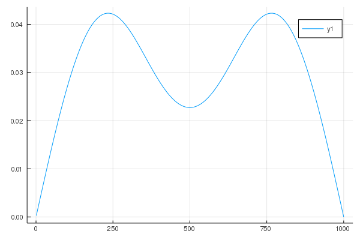
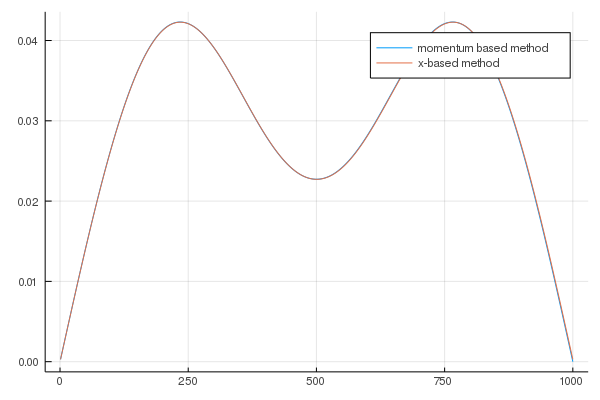
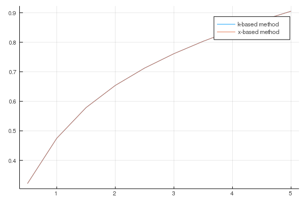
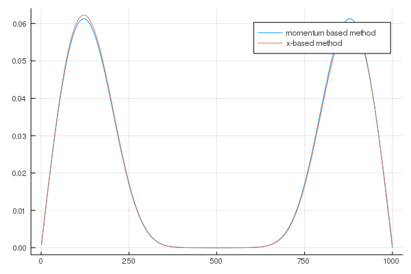
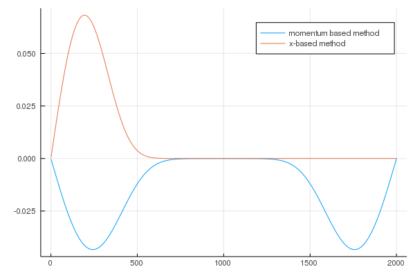
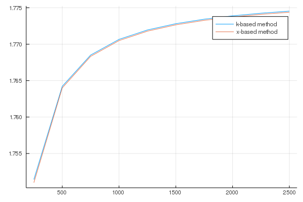

# 波数表示で解いてみる。ガウス関数形ポテンシャルのある問題
## 波数表示でのシュレーディンガー方程式

シュレーディンガー方程式を別の表示で書いてみる。  
ベクトルの言葉で言えば、``\psi(x)``をベクトル``{\bf \psi}``の``x``成分である（離散化していれば``x_i``は``i``番目の要素）とみなせば、
任意の基底のベクトル``{\bf c}``はユニタリー行列``U``を用いて
```math
{\bf \psi} = U{\bf c}
```
と書ける。
成分表示だと
```math
\psi_i = \sum_k U_{ik} c_k
```
となり、``U_{ik}``を
```math
U_{ik} = \exp (i k x_i)
```
とおけば、フーリエ変換となっていることがわかる。  
離散化しない場合には、
```math
\psi(x) = \frac{1}{2\pi}\int dk \exp (i k x) c_k
```
である。   
このとき、
```math
\frac{1}{2\pi}\int dk  \left( \frac{\hbar^2}{2m}k^2 + V(x) \right) \exp (i k x) c_k = \epsilon \frac{1}{2\pi}\int dk  \exp (i k x) c_k
```
となる。ここで、ポテンシャル``V(x)``をフーリエ変換すると
```math
V(x) = \frac{1}{2\pi}\int dq  \exp(i q x) V_q
```
となるので、
``\exp (- i k' x)``をかけて``x``で積分すると
```math
\int dx \frac{1}{2 \pi} \int dk \left( \frac{\hbar^2}{2m}k^2 + \left(\frac{1}{2\pi}\int dq \exp(i q x) V_q \right) \right) \exp (i (k-k') x) c_k = \epsilon \int dx \frac{1}{2 \pi} \int dk \exp (i (k-k') x) c_k
```
```math
\frac{\hbar^2}{2m}k'^2 c_{k'}  + \int dx \frac{1}{2\pi}\int dq \frac{1}{2\pi}\int dk V_q  \exp (i (q + k-k') x) c_k = \epsilon  c_{k'}
```
```math
\frac{\hbar^2}{2m}k'^2 c_{k'}  + \frac{1}{2\pi}\int dk V_{k'-k}  c_k = \epsilon  c_{k'}
```
となる。これが波数表示のシュレーディンガー方程式である。
ここで、
```math
\int dx \exp (i (k-k') x) = 2\pi \delta_{k,k'}
```
を用いた。これは、直感的には、位相の異なる波は全部足しあわせて消えてしまうけれど、位相の同じ波``k=k'``の時だけ残る、ということを表している。


### 両側に壁がある場合
　これまで考えてきた、両側に壁がある場合を波数表示で解いてみよう。  
 境界条件は、
```math
 \psi(x=0) = 0
```
```math
 \psi(x=L)=0
```
 である。
 解を
```math
 \psi(x) = \frac{1}{2\pi}\int dk \exp(ikx)c_k
```
 と置く。
 このとき、
```math
\frac{1}{2\pi}\int dk c_k = 0
```
```math
\frac{1}{2\pi}\int dk \exp(ikL)c_k=0
```
 が境界条件となる。しかし、これらの境界条件をみたすように解を決めるのは難しい。なぜなら、それぞれの固有値に対応する固有関数ごとに、これらの境界条件を満たさなければならないからである。もし、あらかじめ一般解が求められている場合、一般解を得たあとに境界条件によって係数``c_k``を決めることができる。例えば、ポテンシャルがゼロの場合、一般解は
```math
 \psi_n(x) = C_1 e^{ikx}+C_2 e^{-ikx}
```
 であり、ある固有値``\epsilon``があるとき、波数``k``が定まる（``k``はいい量子数である、とも言う。）。しかし、ポテンシャルがある場合には、波数表示のシュレーディンガー方程式をみればわかるように、ある固有値に対する固有関数は複数の波数を持つ。どのような複数の波数をもつかは、解いてみないとわからないので、境界条件を満たすためにどのようにすればよいかがわからない。  
 これを解決するために、解を少し書き換えてみよう。
```math
  \psi(x) = \frac{1}{2\pi}\int_{0}^{\infty} dk \exp(ikx)c_k + \frac{1}{2\pi}\int_{-\infty}^{0}dk  \exp(ikx)c_k
```
```math
  = \frac{1}{2\pi}\int_{0}^{\infty} dk \exp(ikx)c_k + \frac{1}{2\pi}\int_{0}^{\infty} dk \exp(-ikx)c_{-k}
```
```math
  = \frac{1}{2\pi}\int_{0}^{\infty} dk \left[  \exp(ikx)c_k + \exp(-ikx)c_{-k}\right]
```
 とする。さらに、
```math
   \psi(x) = \frac{1}{2\pi}\int_{0}^{\infty} dk \left[  (\cos (kx)+i \sin (kx)) c_k + (\cos (kx)-i \sin (kx))c_{-k}\right]
```
```math
   = \frac{1}{2\pi}\int_{0}^{\infty} dk \left[  (c_k + c_{-k}) \cos (kx)+i (c_k - c_{-k})\sin (kx)) \right]
```
 と書き換え、``a_k = c_k + c_{-k}``, ``b_k = i(c_k - c_{-k})``と新しい定数を定義すると、
```math
   \psi(x) = \frac{1}{2\pi}\int_{0}^{\infty} dk  a_k \cos (kx) +\frac{1}{2\pi}\int_{0}^{\infty} dk  b_k \sin (kx) 
```
 となる。
 この形で見ると、一つ目の境界条件
```math
 \psi(x=0) = 0
```
 は
```math
 a_k = 0
```
 に、もう一つの境界条件
```math
 \psi(x=L)=0
```
 は
```math
 k = n \frac{\pi}{L} \: \: \: (n=1,2,3,\cdots)
```
 となる。  
 そして、``k>0``として、``k``に関するシュレーディンガー方程式
```math
\frac{\hbar^2}{2m}k^2 c_{k}  + \frac{1}{2\pi}\int_{-\infty}^{\infty} dk'  V_{k-k'}  c_{k'} = \epsilon  c_{k}
```
から
``-k``に関するシュレーディンガー方程式
```math
\frac{\hbar^2}{2m}k^2 c_{-k}  + \frac{1}{2\pi}\int_{-\infty}^{\infty} dk'  V_{-k-k'}  c_{k'} = \epsilon  c_{-k}
```
を差し引くと、
```math
\frac{\hbar^2}{2m}k^2 (c_{k}-c_{-k})  + \frac{1}{2\pi}\int_{-\infty}^{\infty}dk' (V_{k-k'}-V_{-k-k'} )  c_{k'} = \epsilon  (c_{k}-c_{-k})
```
```math
\frac{\hbar^2}{2m}k^2 (c_{k}-c_{-k})  + \frac{1}{2\pi}\int_{0}^{\infty}dk' (V_{k-k'}-V_{-k-k'} )  c_{k'} + \frac{1}{2\pi}\int_{0}^{\infty}dk' (V_{k+k'}-V_{-k+k'} )  c_{-k'}= \epsilon  (c_{k}-c_{-k})
```
```math
\frac{\hbar^2}{2m}k^2 (c_{k}-c_{-k})  + \frac{1}{2\pi}\int_{0}^{\infty}dk'  \left[ (V_{k-k'}-V_{-k-k'} )  c_{k'}-(V_{k+k'}-V_{-k+k'} )  (-c_{-k'}) \right]= \epsilon  (c_{k}-c_{-k})
```
```math
\frac{\hbar^2}{2m}k^2 b_k  + \frac{1}{2\pi}\int_{0}^{\infty}dk'  \left[ V_{k-k'}-V_{-k-k'} -V_{k+k'}+V_{-k+k'}  \right] b_{k'} = \epsilon  b_k
```
となる。

#### 数値的に解く
さて、以上で問題を整理できたので、実際に数値的に解いてみよう。ポテンシャルは前回のノートで導入したガウス関数とする。

```math
V(x) = V_0 \exp \left[- \frac{(x-x_0)^2}{\xi^2} \right]
```
ガウス関数のフーリエ変換
```math
\int_{-\infty}^{\infty} dx e^{- i q x} e^{-ax^2} = \sqrt{\frac{\pi}{a}} \exp (-\frac{q^2}{4a})
```
より
```math
V(q) = \int_{-\infty}^{\infty} dx e^{- i q x} V(x) = V_0 \int_{-\infty}^{\infty} dx e^{- i q (x+x_0)}
\exp \left[- \frac{1}{\xi^2}x^2 \right]
```
```math
= V_0 e^{-i q x_0} v(q)
```
```math
v(q) = \sqrt{\pi \xi^2} \exp (-\frac{q^2 \xi^2}{4})
```
となる。  
よって、``V_{k-k'}-V_{-k-k'} -V_{k+k'}+V_{-k+k'}``は
```math
V_{k-k'}-V_{-k-k'} -V_{k+k'}+V_{-k+k'} = V_0 \left(
e^{-i (k-k') x_0} v(k-k')-e^{-i (-k-k') x_0} v(-k-k')-e^{-i (k+k') x_0} v(k+k')+e^{-i (-k+k') x_0} v(-k+k')
\right)
```
```math
= V_0 \left(
e^{-i (k-k') x_0} v(k-k')+e^{i (k-k') x_0} v(k-k')-e^{-i (k+k') x_0} v(k+k')-e^{i (k+k') x_0} v(k+k')
\right)
```
```math
= 2 V_0 \left( \cos ((k-k') x_0) v(k-k') - \cos ((k+k') x_0) v(k+k')
\right)
```
となる。

前回のノートを合わせるために、

```julia
N=1000
a = 0.01
dx = N/6
ξ = dx*a
center = (N+1)/2
x0 = center*a
```

とする。その結果、ポテンシャルは

```julia
function calc_vq(q,ξ,V0)
    vq = sqrt(π*ξ^2)*exp(-q^2*ξ^2/4)
    return vq
end
```

となり、``V_{k-k'}-V_{-k-k'} -V_{k+k'}+V_{-k+k'} ``は

```julia
function calc_Vkkp(k,kp,ξ,x0,V0)
    q1 = k - kp
    vq1 = calc_vq(q1,ξ,V0)
    q2 = k + kp
    vq2 = calc_vq(q2,ξ,V0)
    Vkkp = 2*V0*(cos(q1*x0)*vq1 - cos(q2*x0)*vq2)
    return Vkkp
end
```

となる。$k'$に関する積分は、$k'$が離散的にしかとれないため、
```math
dk' \sim \frac{\pi}{L}
```
と近似し、積分を和に置き換える。
そして、ハミルトニアンは

```julia
function make_Hk(N,a,V0)
    mat_Hk = zeros(Float64,N,N)
    dx = N/6
    ξ = dx*a
    center = (N+1)/2
    x0 = center*a
    L = (N+1)*a
    for n in 1:N
        k = n*π/L
        for np in 1:N
            v = 0.0            
            if n == np
                v = k^2
            end
            kp = np*π/L
            Vkkp = calc_Vkkp(k,kp,ξ,x0,V0) 
            v += Vkkp*(1/2L)
            mat_Hk[n,np]= v
        end
    end
    return mat_Hk
end
```

である。ポテンシャルがない時は

```julia
using LinearAlgebra #対角化のルーチンeigenを呼ぶ準備 v0.7以降必要

V0 = 0.0
mat_H = make_Hk(N,a,V0)
ε,ψ = eigen(mat_H)
println("Potential = ",V0," Minimum eigenvalue = ",ε[1])
```

```
Potential = 0.0 Minimum eigenvalue = 0.09849894761671256
```

となる。これは、厳密解
```math
\epsilon = n^2 \frac{\pi^2}{L^2}
```

```julia
a = 0.01
L = (N+1)*a
ε1 = π^2/L^2
println(ε1)
```

```
0.09849894761671255
```

とほぼ一致する。

ポテンシャルがある場合、

```julia
using Plots
gr()
```

```julia
V0 = 1.0
N = 1000
a = 0.01
mat_H = make_Hk(N,a,V0)
ep,psi = eigen(mat_H)
println(ep[1])
a = 0.01
rp = zeros(Float64,N)
L = a*N
for i in 1:N
    xi = a*i
    for ik in  1:N
        k = π*ik/L
        rp[i] += psi[ik,1]*sin(k*xi)
    end
end


C = sum(dot(rp[1:N],rp[1:N]))
rp = rp/sqrt(C)

xin = []
for i in 1:N
    push!(xin,i)
end
plot(xin,rp)
```

```
0.4749787534206423
```

 


最低エネルギーの解は上のようになる。差分化した場合と解を比べてみよう。差分化のハミルトニアンとポテンシャルは

```julia
function make_H1dv(N,a,V0)
    mat_H = zeros(Float64,N,N)
    vec_V = calc_V(N,V0)
        
    for i in 1:N
        for dx in -1:1
            j = i + dx
            v = 0.0
            if dx == 0
                v = (2/a^2 + vec_V[i])
            elseif dx == 1
                v = -1/a^2
            elseif dx == -1
                v = -1/a^2
            end
            
            if 1 <= j <= N
                mat_H[i,j] = v
            end
            
        end
        
    end
    
    
    return mat_H
end

function calc_V(N,V0)
    vec_V = zeros(Float64,N)
    dx = N/6
    center = (N+1)/2
    for i in 1:N
        vec_V[i] = V0*exp(-(i-center)^2/(dx^2))
    end
    return vec_V
end
```

なので、二つを重ねてプロットすると

```julia
N = 1000
a = 0.01
V0=1.0
mat_Hx = make_H1dv(N,a,V0)
εx,ψx = eigen(mat_Hx)
plot(xin,[rp,ψx[1:N,1]],label=["momentum based method" "x-based method"])
```

 

となり、二つの方法は完全に同じ解を出している。  
そして、ポテンシャルの強さを変えると、

```julia
a = 0.01
N=1000

function gs1(a,N)
    minimums =[]
    for v in 1:10
        V0 = v*0.5
        mat_H = make_Hk(N,a,V0)
        ε,ψ = eigen(mat_H)
        push!(minimums,ε[1])
        println("Potential = ",V0," Minimum eigenvalue = ",ε[1])
    end  
    return minimums
end
minimums = gs1(a,N)
```

```
Potential = 0.5 Minimum eigenvalue = 0.32166861033304633
Potential = 1.0 Minimum eigenvalue = 0.47497875342064344
Potential = 1.5 Minimum eigenvalue = 0.5788045644645459
Potential = 2.0 Minimum eigenvalue = 0.6539481895346537
Potential = 2.5 Minimum eigenvalue = 0.7126726541930689
Potential = 3.0 Minimum eigenvalue = 0.7613358304278549
Potential = 3.5 Minimum eigenvalue = 0.8033245079819215
Potential = 4.0 Minimum eigenvalue = 0.840571407201232
Potential = 4.5 Minimum eigenvalue = 0.8742613856328483
Potential = 5.0 Minimum eigenvalue = 0.9051684806256943
```

となる。  
差分化した場合と比較してプロットすると、

```julia
a = 0.01
N=1000
function gs2()
    minimums_x =[]
    for v in 1:10
        V0 = v*0.5
        mat_Hx = make_H1dv(N,a,V0)
        εx,ψx = eigen(mat_Hx)
        push!(minimums_x,εx[1])
        println("Potential = ",V0," Minimum eigenvalue = ",εx[1])
    end 
    return  minimums_x
end
minimums_x = gs2()

function gs3()
    potentials = []
    for v in 1:10
        V0 = v*0.5
        push!(potentials,V0)
    end
    return potentials
end
potentials = gs3()

plot(potentials,[minimums,minimums_x],label=["k-based method" "x-based method"])
```

```
Potential = 0.5 Minimum eigenvalue = 0.3216680437594529
Potential = 1.0 Minimum eigenvalue = 0.47497702625749055
Potential = 1.5 Minimum eigenvalue = 0.5788014430373154
Potential = 2.0 Minimum eigenvalue = 0.6539436690715744
Potential = 2.5 Minimum eigenvalue = 0.7126667576418749
Potential = 3.0 Minimum eigenvalue = 0.7613285627430311
Potential = 3.5 Minimum eigenvalue = 0.8033158575112843
Potential = 4.0 Minimum eigenvalue = 0.8405613523837149
Potential = 4.5 Minimum eigenvalue = 0.8742498997697548
Potential = 5.0 Minimum eigenvalue = 0.905155534659135
```
 

となり、ほとんと結果は変わらない。  
最後に、非常に大きなポテンシャルをいれて、ふるまいを見てみよう。

```julia
V0 = 40.0
N = 1000
a = 0.01
mat_H = make_Hk(N,a,V0)
ep,psi = eigen(mat_H)
println("momentum-based method: ",ep[1])
a = 0.01
rp = zeros(Float64,N)
L = a*N
for i in 1:N
    xi = a*i
    for ik in  1:N
        k = π*ik/L
        rp[i] += psi[ik,1]*sin(k*xi)
    end
end


C = sum(dot(rp[1:N],rp[1:N]))
rp = rp/sqrt(C)

xin = []
for i in 1:N
    push!(xin,i)
end

mat_Hx = make_H1dv(N,a,V0)
εx,ψx = eigen(mat_Hx)
println("x-based method ",εx[1])
plot(xin,[rp,ψx[1:N,1]],label=["momentum based method" "x-based method"])
```

```
momentum-based method: 1.7706582149528631
x-based method 1.7704925469067738
```
 

少しずれた。どちらが正しいのだろうか。``a``の値を変えてみる。

```julia
V0 = 40.0
N = 2000
a = 0.005
mat_H = make_Hk(N,a,V0)
ep,psi = eigen(mat_H)
println("momentum-based method: ",ep[1])
a = 0.01
rp = zeros(Float64,N)
L = a*N
for i in 1:N
    xi = a*i
    for ik in  1:N
        k = π*ik/L
        rp[i] += psi[ik,1]*sin(k*xi)
    end
end


C = sum(dot(rp[1:N],rp[1:N]))
rp = rp/sqrt(C)

xin = []
for i in 1:N
    push!(xin,i)
end

mat_Hx = make_H1dv(N,a,V0)
εx,ψx = eigen(mat_Hx)
println("x-based method ",εx[1])
plot(xin,[rp,ψx[1:N,1]],label=["momentum based method" "x-based method"])
```

```
momentum-based method: 1.7738901472889101
x-based method 0.7101076631125441
```

 

違いがでてきた。左右対称になっている分、波数表示のほうが精度がよいと思われる。

```julia
a = 0.01
N=1000
function gs4()
    minimums =[]
    V0 = 40.0
    for nn in 1:10
        N = 250*nn
        a = 10.0/N
        mat_H = make_Hk(N,a,V0)
        ε,ψ = eigen(mat_H)
        push!(minimums,ε[1])
        println("Number = ",N," Minimum eigenvalue = ",ε[1])
    end 
    return minimums,ψ
end
minimums,ψ = gs4()

a = 0.01
N=1000
function gs5()
    minimums_x =[]
    for nn in 1:10
        N = 250*nn
        a = 10.0/N
        mat_Hx = make_H1dv(N,a,V0)
        εx,ψx = eigen(mat_Hx)
        push!(minimums_x,εx[1])
        println("Number = ",N," Minimum eigenvalue = ",εx[1])
    end  
    return minimums_x,ψx
end
minimums_x,ψx = gs5()

function gs6()
    numbers = []
    for nn in 1:10
        N = 250*nn
        push!(numbers,N)
    end
    return numbers
end
numbers = gs6()

plot(numbers,[minimums,minimums_x],label=["k-based method" "x-based method"])
```

```
Number = 250 Minimum eigenvalue = 1.751430241169984
Number = 500 Minimum eigenvalue = 1.7642178126259767
Number = 750 Minimum eigenvalue = 1.7685079437298705
Number = 1000 Minimum eigenvalue = 1.7706582149528631
Number = 1250 Minimum eigenvalue = 1.7719500472705696
Number = 1500 Minimum eigenvalue = 1.7728119653499836
Number = 1750 Minimum eigenvalue = 1.7734279625561844
Number = 2000 Minimum eigenvalue = 1.7738901472889101
Number = 2250 Minimum eigenvalue = 1.7742497350624604
Number = 2500 Minimum eigenvalue = 1.7745374750821823
Number = 250 Minimum eigenvalue = 1.7510002431811835
Number = 500 Minimum eigenvalue = 1.7640001313662867
Number = 750 Minimum eigenvalue = 1.7683290109090355
Number = 1000 Minimum eigenvalue = 1.7704925469067738
Number = 1250 Minimum eigenvalue = 1.771790369471922
Number = 1500 Minimum eigenvalue = 1.7726554576321534
Number = 1750 Minimum eigenvalue = 1.7732733148806288
Number = 2000 Minimum eigenvalue = 1.7737366731519555
Number = 2250 Minimum eigenvalue = 1.7740970422564775
Number = 2500 Minimum eigenvalue = 1.7743853244582213
```

 

波数表示のほうが若干精度がよい気がする。一方、一番``N``が大きいときの最小値の解は

```julia
N = 2500
V0 = 40.0
a = 10.0/N
mat_H = make_Hk(N,a,V0)
ε,ψ = eigen(mat_H)

mat_Hx = make_H1dv(N,a,V0)
εx,ψx = eigen(mat_Hx)

rp = zeros(Float64,N)
L = a*N
for i in 1:N
    xi = a*i
    for ik in  1:N
        k = π*ik/L
        rp[i] += ψ[ik,1]*sin(k*xi)
    end
end


C = sum(dot(rp[1:N],rp[1:N]))
rp = rp/sqrt(C)

xin = []
for i in 1:N
    push!(xin,i)
end

println("x-based method ",εx[1])
plot(xin,[-rp,ψx[1:N,1]],label=["momentum based method" "x-based method"])
```

```
x-based method 1.7743853244582213
```

 

両方ともよい精度が出ているように見える